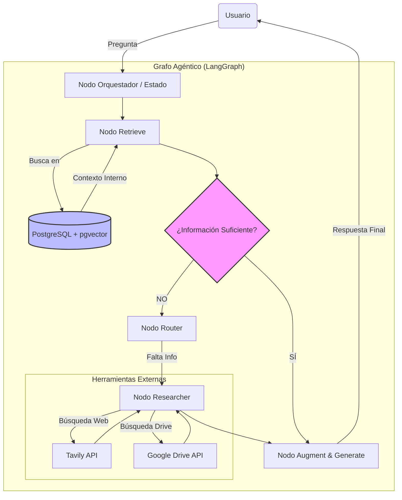
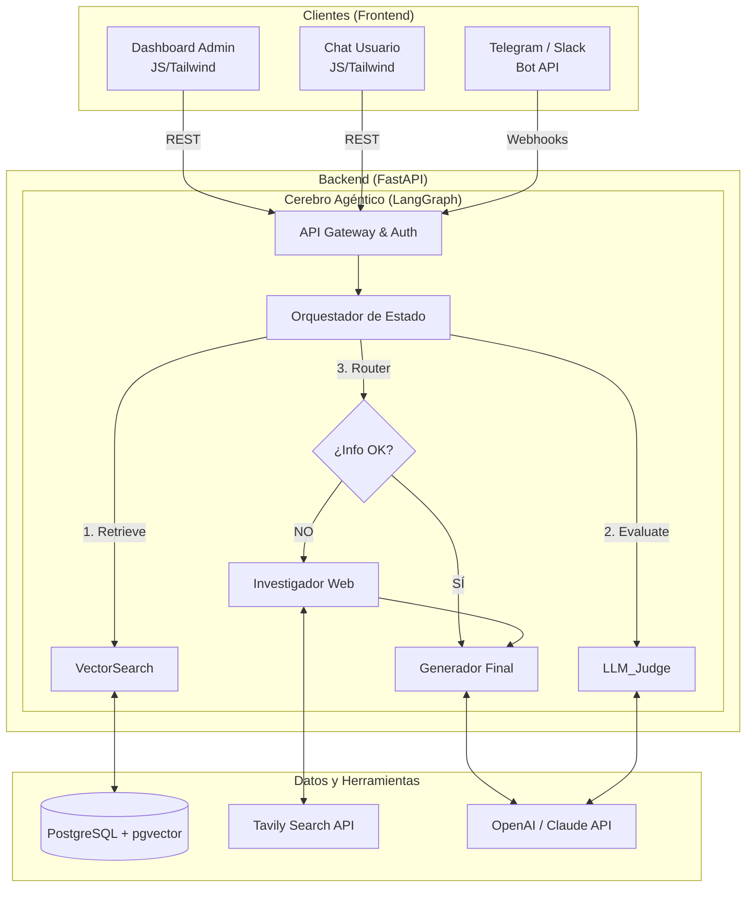

# Capstone presentación

---

# Resumen Ejecutivo: HARI (Human-Augmented Resource Intelligence)

## 1. Concepto y visión

HARI se define como un **"Segundo cerebro digital" y Asistente agéntico**. Su propósito es transformar la sobrecarga de información desestructurada (URLs, PDFs, conversaciones de chat) en conocimiento accionable. A diferencia de los sistemas de gestión documental tradicionales, HARI no solo almacena información, sino que **razona sobre ella**, determinando autónomamente si posee el conocimiento suficiente para responder o si debe investigar externamente.

## 2. Problemática

Los profesionales modernos enfrentan una dispersión masiva de datos y una "amnesia corporativa": información valiosa compartida en canales informales (Telegram/Slack) o almacenada en documentos largos (Drive) se pierde o es costosa de recuperar. Los sistemas RAG (Retrieval-Augmented Generation) tradicionales fallan cuando la respuesta no está en la base de datos, generando alucinaciones o respuestas vacías.

## 3. Arquitectura de RAG agéntico

Para superar las limitaciones del RAG estático, HARI implementa una arquitectura **Agéntica basada en Grafos (LangGraph)**. El sistema deja de ser una tubería lineal para convertirse en un **ciclo cognitivo** capaz de evaluar su propia calidad.

### Flujo de Funcionamiento:

1. **Ingesta Inteligente (Memoria a largo plazo):**
    - HARI captura y procesa documentos (Drive, Web, …) usando un pipeline de optimización de costes (Resumen extractivo + LLM) para generar *embeddings* en **PostgreSQL (pgvector)**.
2. **Recuperación y Evaluación (El Cerebro Agéntico):**
    - **Nodo recuperador:** Ante una consulta, busca primero en la base de conocimiento interna.
    - **Nodo evaluador:** Un LLM ligero analiza los documentos recuperados. ¿Es la información suficiente y relevante?
    - **Nodo router (Toma de Decisión):**
        - *Sí es suficiente:* Pasa al **Nodo generador** para responder al usuario.
        - *No es suficiente:* Activa el **Nodo investigador** (Researcher), que utiliza herramientas externas (búsqueda web vía Tavily o Deep Research) para enriquecer el contexto.
3. **Generación Aumentada:** El sistema sintetiza la información interna y externa para dar una respuesta precisa y citada.
4. **Seguridad:** El nodo router incluye mecanismos de seguridad (Guardrails) para evitar que el agente entre en bucles infinitos de búsqueda si no encuentra la respuesta tras X intentos.

## 4. Arquitectura técnica y componentes

### 4.1 Núcleo del Sistema: Backend y Orquestación Agéntica

El corazón de HARI se basa en un servidor de inferencia agéntica. El backend no solo procesa datos, sino que gestiona el estado conversacional y la toma de decisiones autónoma.

- **API y orquestador:** Desarrollado en **FastAPI**, expone endpoints asíncronos que ejecutan el grafo de decisión construido con **LangGraph**. Este grafo gestiona el flujo entre nodos (recuperación, evaluación, investigación) manteniendo la memoria del estado de la conversación.
- **Gestión de datos híbrida:** Utiliza **PostgreSQL** como fuente de verdad única, manejando tanto metadatos relacionales (usuarios, costes, logs) como vectores semánticos mediante la extensión **pgvector**.
- **Servicios en segundo plano:** Implementa *workers* asíncronos para tareas pesadas (ingesta masiva desde Drive o *scraping* profundo), asegurando que la API de chat mantenga baja latencia.

### 4.2 Capa de presentación (Frontend)

Se propone una interfaz web ligera y desacoplada, dividida en dos módulos funcionales para diferenciar roles:

- **Dashboard de administración (Gestión):**
    - Visualización de métricas de consumo (tokens/coste) y rendimiento del sistema.
    - Gestión de ingesta de documentos: subida de archivos, conexión con carpetas de Google Drive y reindexación manual.
    - Panel de control de calidad para auditar las decisiones del agente (verificar cuándo decide buscar en web vs. usar memoria interna).
- **Interfaz de consulta (Chat):**
    - UI conversacional minimalista (estilo ChatGPT) para el usuario final.
    - Visualización del "proceso de pensamiento": Muestra al usuario qué está haciendo el agente en tiempo real (ej: *"Consultando memoria...", "Información insuficiente, buscando en Tavily..."*).

### 4.3 Extensibilidad: Arquitectura "headless" (Telegram/Slack)

La arquitectura se ha diseñado bajo el principio *API-First*. La lógica del agente RAG está totalmente desacoplada de la interfaz web, lo que permite una integración nativa con plataformas de mensajería:

- **Bot connector:** Un servicio intermedio (Webhook Handler) que traduce los mensajes entrantes de **Telegram** o **Slack** en objetos `State` que el grafo de LangGraph puede procesar.
- **Experiencia ubicua:** El usuario puede iniciar una consulta en la web y continuarla en Telegram, ya que el historial y el contexto residen en la base de datos centralizada, no en el dispositivo cliente.

### Diagrama de arquitectura global (Full Stack + Agente)

## 5. Stack tecnológico

- **Orquestación agéntica:** LangChain + LangGraph (gestión de estado y grafos). Se seleccionó LangGraph frente a orquestadores lineales (Chains) o frameworks de rol (CrewAI) debido a la necesidad de un control determinista sobre el flujo de evaluación cíclica y la gestión robusta del estado conversacional.
- **Core backend:** FastAPI + Python 3.12.
- **Memoria Vectorial:** PostgreSQL + pgvector (persistencia híbrida: relacional y semántica).
- **LLMs:** Enfoque híbrido (GPT-4 para razonamiento complejo/evaluación, Claude Sonnet para síntesis masiva).
- **Herramientas (Tools):** Tavily (Búsqueda Web), Google Drive API.

## 6. Valor diferencial

- **Autonomía:** HARI sabe lo que no sabe y busca activamente la respuesta.
- **Eficiencia de Costes:** Mantiene la reducción del 95% en costes de ingesta mediante resúmenes extractivos previos, usando LLMs potentes solo para el razonamiento agéntico.
- **Modularidad:** La arquitectura de grafos permite añadir nuevas "habilidades" (nodos) sin reescribir el sistema (ej. un nodo para consultar el calendario o CRM).

## 7. Plan de validación

Para validar la mejora respecto a un RAG tradicional, se realizará un **test comparativo** con un set de 20 preguntas complejas que requieran razonamiento o información externa, midiendo la precisión y la completitud de la respuesta generada por HARI frente a un RAG estático estándar.