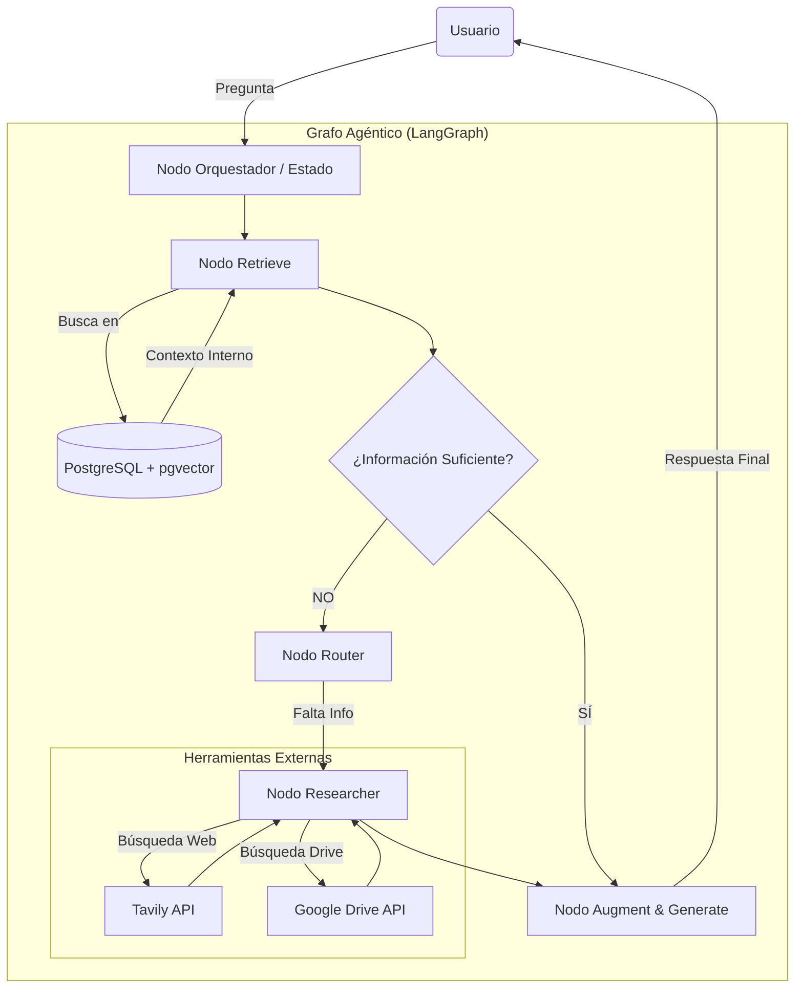

# HARI - Human-Augmented Resource Intelligence
## Proyecto Capstone - Curso Desarrollador 10x
### Instituto de Inteligencia Artificial (IIA)

---

## 1. Información del Proyecto

- **Título:** HARI (Human-Augmented Resource Intelligence)
- **Concepto Central:** Segundo cerebro digital y Asistente Agéntico para la gestión inteligente del conocimiento.
- **Autores:** 
    - Jorge Gutierrez - [LinkedIn](https://www.linkedin.com/in/tecnijota/)
    - Juan Antonio Casado - [LinkedIn](https://www.linkedin.com/in/juan-antonio-casado/)
- **Video de Demostración:** [Ver en YouTube](https://youtu.be/pO1em_m1FWA)
- **Repositorio:** [https://github.com/BothRocks/hari2](https://github.com/BothRocks/hari2)
---

## 2. Resumen Ejecutivo

HARI es un sistema de **RAG Agéntico (Retrieval-Augmented Generation)** diseñado para transformar la sobrecarga de información desestructurada (URLs, PDFs, conversaciones de chat) en conocimiento accionable. 

A diferencia de los sistemas RAG tradicionales que son pasivos y estáticos, HARI implementa un **ciclo cognitivo** capaz de razonar sobre su propio conocimiento, determinando de forma autónoma si posee la información suficiente para responder o si debe investigar en fuentes externas para completar la respuesta.

## 3. Problemática

Los profesionales modernos enfrentan una dispersión masiva de datos y lo que denominamos "amnesia corporativa":
- Información valiosa compartida en canales informales (Telegram/Slack) se pierde.
- Documentos extensos en Google Drive son costosos de recuperar y procesar.
- Los sistemas RAG tradicionales fallan (alucinan o dan respuestas vacías) cuando la información no está en su base de datos local.

## 4. Objetivos del Proyecto

1. **Eliminar la amnesia corporativa:** Centralizar y procesar información de múltiples fuentes (Web, PDF, Drive, Chat).
2. **Superar las limitaciones del RAG estático:** Implementar una arquitectura agéntica capaz de búsqueda externa.
3. **Optimización de costes:** Reducir drásticamente el consumo de tokens mediante un pipeline de ingesta inteligente (resumen extractivo previo a la síntesis).
4. **Accesibilidad ubicua:** Interacción multiplataforma (Web y Bots de mensajería).

---

## 5. Arquitectura Técnica

### 5.1 Flujo del Grafo Agéntico (LangGraph)

HARI utiliza una arquitectura basada en grafos de estado para gestionar el razonamiento. El sistema no es una tubería lineal, sino un ciclo de decisión:

1. **Nodo Recuperador:** Busca en la base de datos vectorial interna (PostgreSQL + pgvector).
2. **Nodo Evaluador:** Un LLM analiza si la información recuperada es relevante y suficiente.
3. **Nodo Router (Toma de Decisión):**
   - Si la información es **suficiente**: Pasa a generación.
   - Si es **insuficiente**: Activa el Nodo Investigador.
4. **Nodo Investigador (Researcher):** Utiliza herramientas externas (Tavily Search API o Google Drive) para enriquecer el contexto.
5. **Nodo Generador:** Sintetiza la respuesta final con citas precisas.



### 5.2 Pipeline de Ingesta Inteligente

Para mantener la eficiencia, HARI procesa los documentos en 7 etapas:
- **Adquisición:** Captura de contenido desde URL, PDF o Drive.
- **Limpieza:** Eliminación de ruido y "boilerplate".
- **Resumen Extractivo:** Uso de algoritmos locales (TextRank) para reducir tokens en un 50-70% sin coste de API.
- **Síntesis LLM:** Generación de resúmenes estructurados y metadatos con Claude/GPT-4.
- **Embeddings:** Generación de vectores semánticos (OpenAI text-embedding-3).
- **Almacenamiento:** Persistencia híbrida en PostgreSQL.

---

## 6. Stack Tecnológico

El proyecto utiliza las herramientas clave aprendidas en el curso **Desarrollador 10x**:

- **Backend:** FastAPI (Python 3.12) - API asíncrona de alto rendimiento.
- **Orquestación Agéntica:** LangGraph & LangChain - Gestión de estados y ciclos de razonamiento.
- **Base de Datos:** PostgreSQL + pgvector - Almacenamiento relacional y vectorial.
- **LLMs:** Claude 3.5 Sonnet (razonamiento principal) y GPT-4o (fallback y tareas específicas).
- **Herramientas de Agente:** Tavily (Búsqueda Web), Google Drive API.
- **Frontend:** React + Tailwind CSS (Vite) - Interfaz moderna y responsive.
- **Integraciones:** Webhooks para bots de Telegram y Slack.
- **Gestión de Dependencias:** [uv](https://github.com/astral-sh/uv) para una gestión ultrarrápida de paquetes Python.

---

## 7. Instalación y Configuración

### Requisitos Previos
- PostgreSQL 15+ con la extensión `pgvector`.
- Python 3.11+ instalado.
- Node.js 18+.

### Configuración del Backend
```bash
cd backend
cp .env.example .env  # Configura tus claves de API (OpenAI, Anthropic, Tavily)
uv sync
uv run alembic upgrade head
```

### Configuración del Frontend
```bash
cd frontend
npm install
```

### Ejecución
1. **Servidor Backend:** `cd backend && uv run uvicorn app.main:app --reload`
2. **Servidor Frontend:** `cd frontend && npm run dev`

Accede a `http://localhost:5173` para empezar a usar HARI.

---

## 8. Valor Diferencial

HARI no es solo un chat con documentos; es un sistema **autónomo**:
- **Sabe lo que no sabe:** No inventa respuestas si no tiene datos, los busca.
- **Eficiencia Real:** Ahorro del 95% en costes de ingesta mediante pre-procesamiento local.
- **Arquitectura Headless:** La inteligencia reside en la API, permitiendo usarla desde la web, Telegram, Slack o cualquier otro canal.

---

## Licencia
Este proyecto es parte del Capstone del curso Desarrollador 10x. Licencia MIT.
