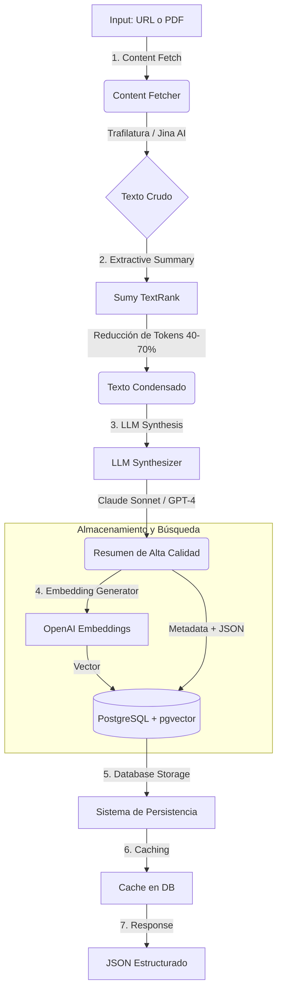

### Resumen del Funcionamiento

Hari es un sistema de gestión de conocimiento y resumen de documentos impulsado por Inteligencia Artificial, diseñado para capturar, procesar y almacenar información de fuentes desestructuradas (como URLs y PDFs). Su objetivo principal es actuar como una "memoria colectiva" y un asistente inteligente.

El funcionamiento del sistema se destaca por los siguientes puntos clave:

- **Optimización de Costes y Eficiencia:** Utiliza un enfoque híbrido para el resumen. En lugar de enviar todo el texto directamente a un LLM (como GPT-4), primero realiza un **resumen extractivo** usando algoritmos clásicos (Sumy TextRank) que reduce los tokens entre un 40-70%. Luego, utiliza un LLM (Claude Sonnet o GPT-4) para sintetizar el resultado final. Esto logra una reducción de costes del 95%.
- **Pipeline de Procesamiento:** Los documentos pasan por un proceso de 7 etapas que incluye la obtención del contenido (usando Trafilatura o Jina AI), la sumarización, la generación de *embeddings* (vectores semánticos) y el almacenamiento.
- **Almacenamiento Inteligente:** Utiliza **PostgreSQL** con la extensión **pgvector**. Esto permite almacenar no solo los metadatos y el texto, sino también vectores para realizar búsquedas semánticas sobre el conocimiento acumulado.
- **Integraciones:** Se integra con **Google Drive** para procesar carpetas de PDFs por lotes y cuenta con autenticación OAuth de Google para gestionar roles de usuario y administrador.
- **Interfaz:** Dispone de un panel de control (Dashboard) web para visualizar métricas, gestionar documentos y realizar búsquedas.

---

### Diagrama de Flujo: Pipeline de Procesamiento (7 Etapas)

Este diagrama representa el flujo de datos descrito en la sección de Arquitectura, desde la entrada (URL/PDF) hasta la respuesta final.

Fragmento de código



---

### Diagrama de Bloques: Arquitectura del Sistema

Este diagrama muestra los componentes tecnológicos y cómo interactúan entre sí, basado en el "Technology Stack" y las características descritas.

```mermaid
graph TB
    subgraph "Frontend / Cliente"
        UI[Web Dashboard]
        User[Usuario]
        User --> UI
    end

    subgraph "Backend (FastAPI)"
        API[API Server]
        Auth[Auth Middleware (Google OAuth)]
        Worker[Async Workers]
        
        UI -->|HTTP Requests| API
        API --> Auth
        API --> Worker
    end

    subgraph "Servicios de Procesamiento (Logic)"
        Fetcher[Content Fetcher]
        ExtSum[Extractive Summarizer (Sumy)]
        
        Worker --> Fetcher
        Worker --> ExtSum
    end

    subgraph "Modelos Externos (AI)"
        LLM[LLM Provider (Anthropic/OpenAI)]
        Embed[Embedding Model (OpenAI)]
        
        Worker -->|Síntesis| LLM
        Worker -->|Vectorización| Embed
    end

    subgraph "Persistencia de Datos"
        DB[(PostgreSQL 15+)]
        VectorDB[pgvector Extension]
        
        Worker -->|Lectura/Escritura| DB
        DB --- VectorDB
    end
    
    subgraph "Fuentes de Datos"
        Drive[Google Drive API]
        Web[Internet (URLs)]
        
        Fetcher --> Web
        Worker -->|Batch Process| Drive
    end
```

`graph TB
    subgraph "Frontend / Cliente"
        UI[Web Dashboard]
        User[Usuario]
        User --> UI
    end

    subgraph "Backend (FastAPI)"
        API[API Server]
        Auth[Auth Middleware (Google OAuth)]
        Worker[Async Workers]
        
        UI -->|HTTP Requests| API
        API --> Auth
        API --> Worker
    end

    subgraph "Servicios de Procesamiento (Logic)"
        Fetcher[Content Fetcher]
        ExtSum[Extractive Summarizer (Sumy)]
        
        Worker --> Fetcher
        Worker --> ExtSum
    end

    subgraph "Modelos Externos (AI)"
        LLM[LLM Provider (Anthropic/OpenAI)]
        Embed[Embedding Model (OpenAI)]
        
        Worker -->|Síntesis| LLM
        Worker -->|Vectorización| Embed
    end

    subgraph "Persistencia de Datos"
        DB[(PostgreSQL 15+)]
        VectorDB[pgvector Extension]
        
        Worker -->|Lectura/Escritura| DB
        DB --- VectorDB
    end
    
    subgraph "Fuentes de Datos"
        Drive[Google Drive API]
        Web[Internet (URLs)]
        
        Fetcher --> Web
        Worker -->|Batch Process| Drive
    end`